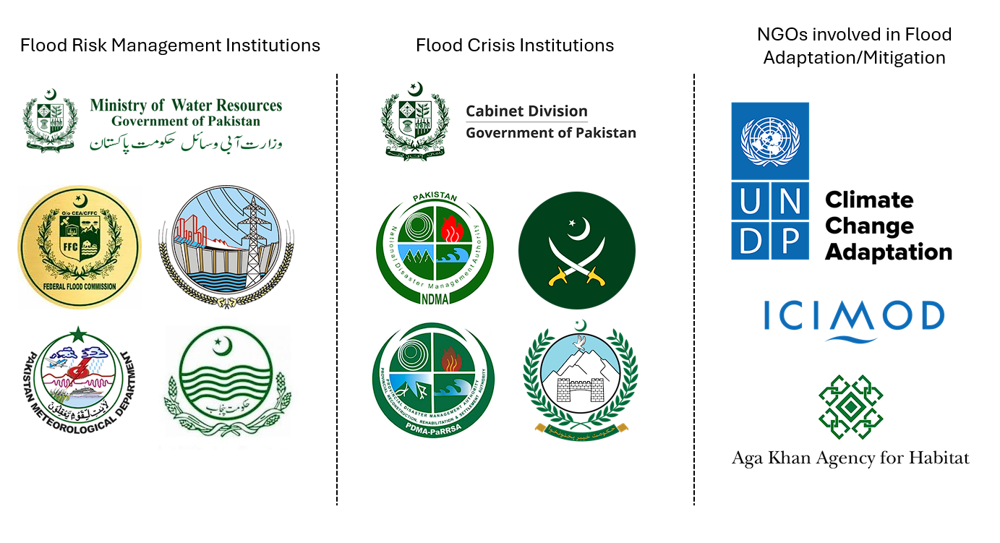
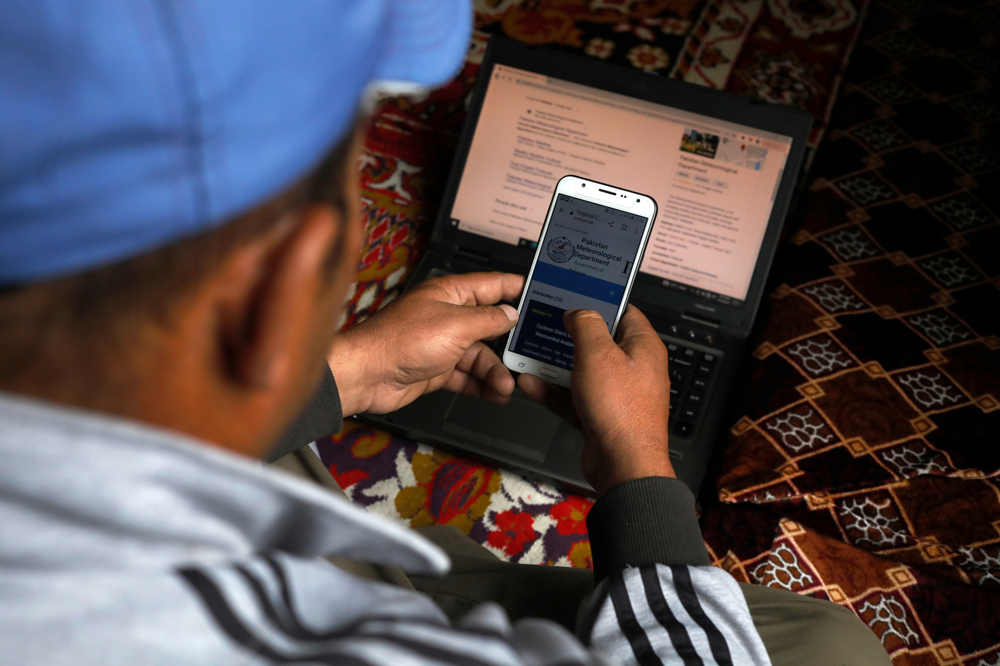
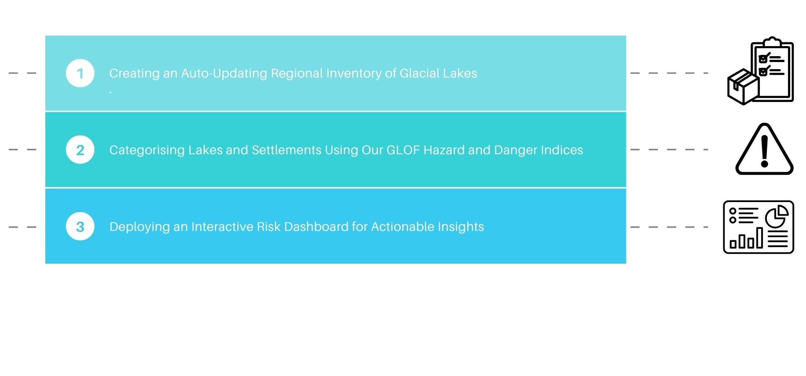
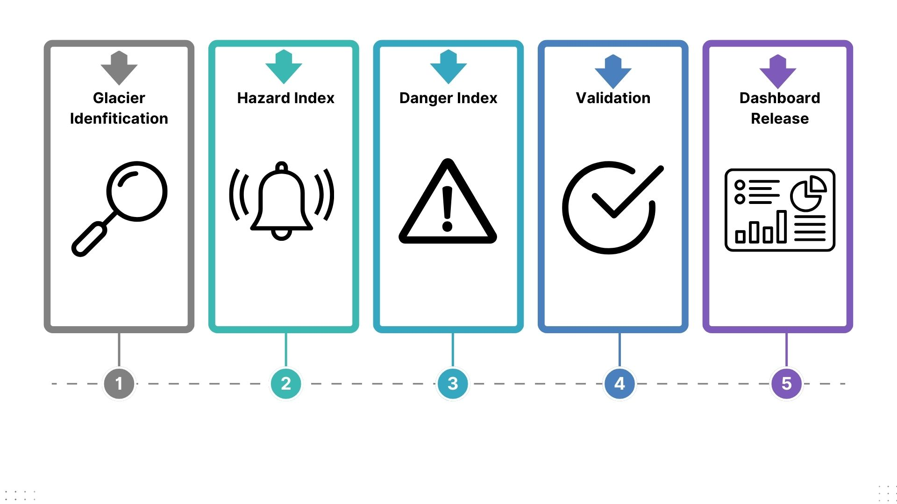
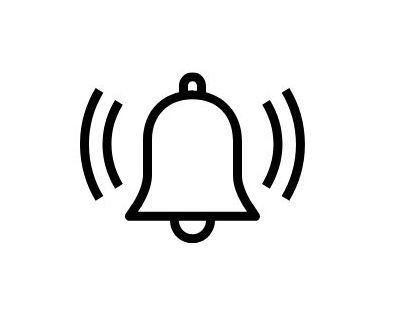
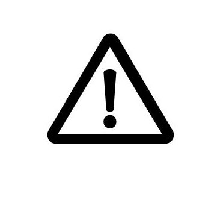
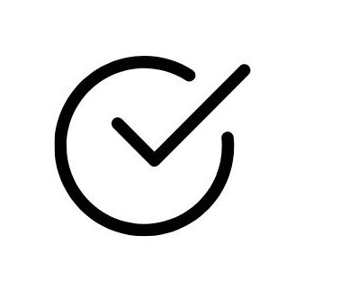
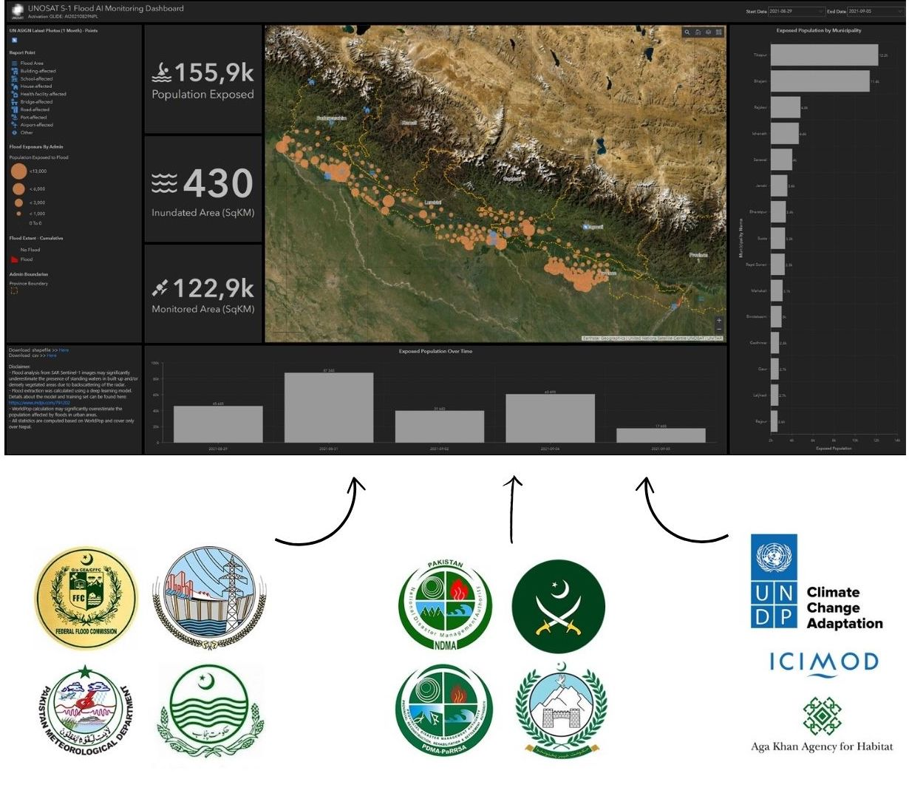

```{r xaringanExtra-search, echo=FALSE}
library(xaringanExtra)
xaringanExtra::use_search(show_icon = TRUE)
```
class: inverse, center, middle

# Current policies and why current strategies are not enough 

### Context & Background

---

# Glacier Lake Outburst Floods

One significant impact of climate change in Pakistan is its **rapidly melting glaciers**. Outside of both poles, Pakistan is the country with the highest number of glaciers in the world - it relies on glaciers for **water, hydropower, and agriculture**. There are significant populations living near glaciers - over 800,000 mountain villagers live within 15km of a glacier (Reuters, 2023) and these villages are exposed to the risk of **Glacier Lake Outburst Floods (GLOF)**. 

.pull-left[

- As a result of glacier melts, over **2420 lakes** in Pakistan have been formed, with **52 lakes at risk of GLOF** every 3-10 years. This number is likely to increase from continual melting.

- It is a contributing factor to the 2022 flood that killed over **1700 people in Pakistan and caused over 40 billion USD in damages**. 

]

.pull-right[

    ```{r, echo=FALSE, out.width="120%"}
    knitr::include_graphics("sensorpresentation_files/img/flood1.jpg")
    ```
]

---
class: inverse, center, middle

# Why Glacier Lake Outburst Floods? 


---
class: inverse, left, middle

# 1. Fast and sudden with massive damages 

# 2. Worsening quickly due to climate change 

# 3. Localised but deadly 

---

# Current policies and strategies 

.pull-left[
While there are flood management policies in Pakistan under its national water policy plan which includes building new water storage, developing new flood procedures, and investing in flood forecasting systems, **there is a lack of policies or plans that specifically deal with flash floods or GLOFs.**

There are also **many institutional silos in managing floods** (Aslam, 2017)

NGOs like UNDP also works with the government and local communities to **develop competencies adapting to flood risks.** 
]

.pull-right[
```{r, echo=FALSE, out.width="200%"}

```
<div style="display: flex; align-items: center;">
  
  <p style="margin: 0; font-weight: bold; background-color: lightblue; padding: 5px; border-radius: 6px">Different organisations working with flood measures at different scales and holding different data</p>
</div>
]

---

# How can we help? 

Problem statement: **"Fragmented coordination among institutions at different scales hampers effective GLOF risk management in Pakistan, increasing vulnerability of at-risk communities."**  

- Lack of coordination between flood institutions especially prior to Monsoon/heatwave seasons; each institution has **their own data and plans but are not shared to form a comprehensive flood plan** 

- This can lead to **missed opportunities for early intervention or incorrect risk assessments.**

- UNDP work with local communities on the ground to install weather stations and carry out workshops to strengthen their resilience, but these are often **not integrated with the different flood institutions**, limiting its effectiveness in the case of GLOF where coordination is required.

<div style="display: flex; align-items: center;">
  

<div class="pull-right" style="width: 80%;">
  <h3>"Our aim is to provide an open- and crowd-sourced data platform which is shared across different stakeholders to coordinate the formation and execution of a GLOF preparation and response plan."</h3>
</div>

---
class: inverse, center, middle

# Methodology  

### Data pipeline, outputs, and operational applications

---
class: center

## Remote Sensing Solutions
---- 
**Our 3 phase programme:** 


---

## Data Collection

```{r include=FALSE, warning=FALSE}
library(tidyverse)
library(kableExtra)
data_sources <- read_csv("sensorpresentation_files/img/data_sources.csv")

# Use kable and kableExtra to create a table with merged cells
kable_out <- kable(data_sources, "html", escape = FALSE, align = 'l') %>%
kable_styling(bootstrap_options = c("bordered", "condensed")) %>%
collapse_rows(columns = 1:5, valign = "middle")
kable_out
# Print the table

```

---

## The Process

```{r xaringan-all, echo=FALSE}
xaringanExtra::use_panelset()
```

.panelset[
.panel[.panel-name[Overview]

]

.panel[.panel-name[Glacier Identification]
.pull-left[
Glacier mass changes drastically throughout the year, so we  calculate seasonal averages of Landsat images.
- Employ digital elevation model to **differentiate terrain shadows from glaciers.** 

- Implement **region-specific** Normalised Difference Water Index and Normalised Difference Snow Index to identify glacier lakes. 

- Apply a region-specific Random forest classification model, using NDWI and NDSI, to ensure rivers, non-glacial lakes are not misclassified as glacier lakes.

- Set up **auto-updates** for the inventory.
]
.pull-right[

]
]

.panel[.panel-name[Hazard Index]
.pull-left[
Our GLOF Hazard Index considers:
- **Slope angles using digital elevation models.**
  - Rock and avalanche impact into a lake is more likely from any slope >30° (Fischer et al., 2012).
  - Downstream, if >50% of  slope pixels are below the 35° typical angle of repose, the dam is considered unstable (CITE). 
- **Lake area using polygon calculation.**  
  - Used as a proxy for lake volume and depth.
- **Watershed area upstream.**
  - Larger watershed area increases the risk of runoff (Allen et al., 2016).
]
.pull-right[

]
]

.panel[.panel-name[Danger Index]
.pull-left[
The GLOF Danger Index  quantifies the potential for loss of life, livelihood and infrastructure:
- LULC and OSM data to identify **man-made structures and communities**
  - Create a binary categorisation of each pixel for presence of infrastructure.
- Modified single-flow model (MSF) for each lake to **determine impacted areas from GLOF event.**
  - Uses digital elevation models to simulate flooding and predict how outburst waters would travel downstream.
  - This model identifies the **precise villages, roads, and agricultural land in the flood’s path, ensuring targeted risk mapping.**
]
.pull-right[

]
]

.panel[.panel-name[Validation]
.pull-left[

Validating our model is key to providing our partners with data they can rely on. 

Community feedback:
- We conduct validation workshops with a range of communities to **ground-truth our data.** 
  - This is especally useful for identifying informal settlements

Validation against previous GLOF events:
- We check our **model rankings against real events that have taken place**, so we can be confident in our predictions of the future.

]
.pull-right[

]
]
]

---

## The Product

.pull-left[

A Google Earth Engine-based dashboard for real-time risk visualisation. Key features include:
- An overlay of our GLOF-HI ™  and GLOF-DI ™ scores with **settlement, population and critical infrastructure data.**

- Early warning notifications:
  - **Seasonal updates to flag lakes transitioning to higher risk categories.**
  - Infrastructure alerts for improved preparedness strategies. 
  
- Free and public access:
  - Agencies and communities can access the dashboard via web or mobile, ensuring **transparency and preparedness.**

]

.pull-right[
<p style="font-size:13px;">UNOSAT S-1 Dashboard. Source: <a href=" https://unitar.org/about/news-stories/news/unosat-flood-ai-dashboards-nepal-creation-one-stop-shop-real-time-evidence-based-decision-making" target="_blank">UNITAR</a></p>


]


---
## Limitations

We are transparent about the challenges we may face.

As our strategy aims to bridge gaps across various agencies, we plan to employ a Unified Training Program, to:
- Teach agencies to interpret the dashboard and integrate it into a centralised disaster response workflow.
- Highlight the importance of of standardised data workflows to reducing redundancy

Conflict zones and physical access:
- Physical access limits in the Kashmir region limit ground truthing data.
- To mitigate this, we employ remote engagement with partner organizations. 


Language and coordination barriers:
- The region is home to diverse communities and languages, complicating outreach.
- We therefore hire local interpreters and leverage partner networks to bridge communication gaps.  

---

